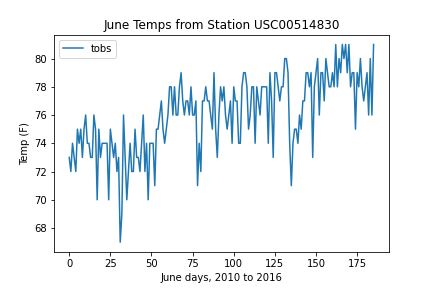
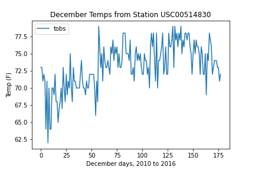
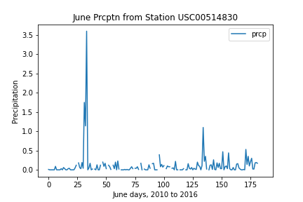
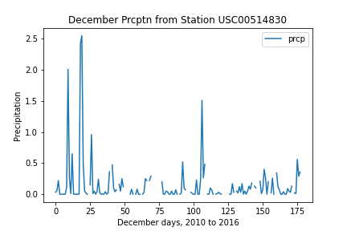

# Week 9 Challenge
##### Miguel Fidelino

## Deliverable 3: A written report for the statistical analysis 

## 1 .Purpose

Query and describe the information about temperature trends before opening a surf shop. Specifically, we must get the temperature data for the months of June and December in Oahu using Pandas.

Libraries used:
SQLAlchemy
SQLite
Pandas

## 2. Results

There is a bulleted list that addresses the three key differences in weather between June and December.

 

- December is generally a degree or three farenheit colder than the months of June.
- December experiences higher volatility in temperature as per the standard deviation of 3.74 (December) as compared to 3.25 (June)
- June experiences lower precipitation on average. See the charts below:

 

## 3. Summary

December and June both experience fairly similar warmth in these two months. Both months also experience a similar precipitation occurences in frequency and in milimeters. All the months of June trend upwards in temperature, while December is starting to trend downwards, which is typical given the season. If a surf shop were to open, it would experience better weather overall in June for surf season, but it would not suffer greatly from weather during December. 
